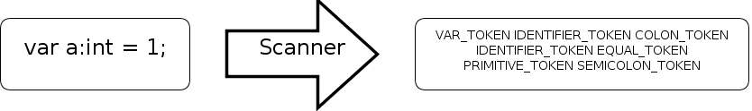
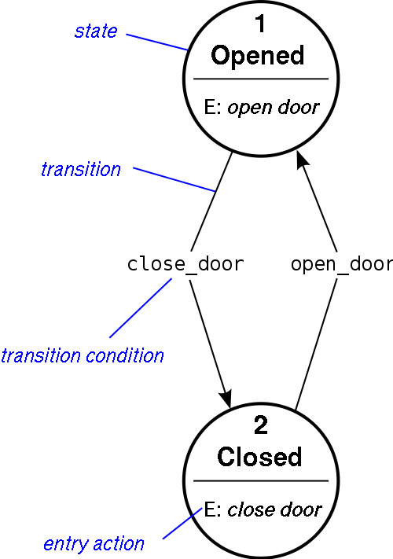

# 二、掃瞄器（Scanner）﹣詞法分析（Lexical analysis）（上）

寫 Compiler 第一步通常都是先寫 Scanner，什麼是 Scanner 呢？這裡只給你初步概念，詳細解釋在維基看吧。試想像有一句英文句子（例子： `”The quick brown fox jumps over the lazy dog” is an English-language pangram.`），人類看英文的方法就是逐個逐個詞語地看，電腦怎樣才能知道要跳過 `”` 雙引號才能讀取第一個詞語呢？那就是要靠 Scanner 來分析了， Scanner 會逐個逐個字元讀進來並且在 “適當時候” 把字元合成一組詞語供後邊的 Parser 做其他處理工作。




單字元的 Token

先來處理比較簡單的單字元 Token 吧，在這裡要先界定一下什麼是單字元 Token（這只是西傑的定義），單字元 Token 的意思是這個 Token 只有一個字元而且不會因後面的字元而有任何歧義，例如 `“:”` 或者 `“;”` 就是了。 `”+”` 是不是單字元 Token 呢？不是，因為 `“+”` 是會有歧義的，它可能是代表 `1 + 1` 中的相加意思，亦可能代表 `i ++` 中加 1 的意思，所以它不是單字元 Token ，而多字元 Token 會在下一節才處理。

現在我們要列出所有單字元 Token 。

```
: COLON_TOKEN

; SEMICOLON_TOKEN

( LEFTPAREN_TOKEN

) RIGHTPAREN_TOKEN

{ LEFTBRACE_TOKEN

} RIGHTBRACE_TOKEN

% MOD_TOKEN
```

就這七款了嗎？其實還有一個是 `EOS_TOKEN` ，代表 `end of stream` ，即已經沒有東西可以讀了，用來終止 Scanner 再讀。

## Reader

現在要開始寫一個 Reader ， Reader 的工作主要是用來逐個逐個字元讀進來，但亦可以退回一個字元下次再讀（這個功能在讀取多字元 Token 會有用），看看 code 吧。

```js
//Reader class
//str is the data to be read

function Reader(str){
    this.data = str;
    this.currPos = 0;
    this.dataLength = str.length;

}

Reader.prototype.nextChar = function (){
    if (this.currPos >= this.dataLength){
        return -1; //end of stream
    }

    return this.data[this.currPos++];
}

//n is the number of characters to be retracted
Reader.prototype.retract = function (n){

    if (n == undefined){
        n = 1;
    }

    this.currPos -= n;

    if (this.currPos < 0){
        this.currPos = 0;
    }
}
```
 
就三個 function ， 一個 constructor ，把要 compile 的字串傳入去，用 `nextChar ()` 來讀取下一個字元，用 `retract ()` 來退回。現在運行一下我們的 tester ，看看 Reader 是否運作正常。

```js
function log(str){
    $("#log").append(str + "<br />");
}
$(function (){
    //we stored our wescript in <script id="wescript">
    var dataToBeCompiled = $("#wescript").text();
    var reader = new Reader(dataToBeCompiled);
    var retracted = false;
    while (true){
        var nextChar = reader.nextChar();
        if (nextChar == -1){
            break;
        }
        //if it meets !, it will retract once
        if (nextChar == "!" && !retracted){
            reader.retract();
            retracted = true;
        }
        log("char: " + nextChar);
    }
});
```
 
運行結果（想看完整的 source code 就按右鍵看吧，iframe 來的）：

Reader 就是這麼簡單了，下一步我們要定義一些常數來識別不同的 Token ，而且要定義一個叫做 Token 的 class 來記下讀取了的 Token 。

```js
//Token class
//type: Token's type
//text: the actual text that makes this token, may be null if it is not important
function Token(type, text){
    this.type = type;
    this.text = text;
}

Token.tokens = {};
Token.tokens.EOS_TOKEN = 1; //end of stream
// using + 1 allows adding a new token easily later
Token.tokens.COLON_TOKEN = Token.tokens.EOS_TOKEN + 1;
Token.tokens.SEMICOLON_TOKEN = Token.tokens.COLON_TOKEN + 1;
Token.tokens.LEFTPAREN_TOKEN = Token.tokens.SEMICOLON_TOKEN + 1;
Token.tokens.RIGHTPAREN_TOKEN = Token.tokens.LEFTPAREN_TOKEN + 1;
Token.tokens.LEFTBRACE_TOKEN = Token.tokens.RIGHTPAREN_TOKEN + 1;
Token.tokens.RIGHTBRACE_TOKEN = Token.tokens.LEFTBRACE_TOKEN + 1;
Token.tokens.MOD_TOKEN = Token.tokens.RIGHTBRACE_TOKEN + 1;
Token.backwardMap = {}; //for inverse look-up

for (var x in Token.tokens){
    Token.backwardMap[Token.tokens[x]] = x;
}
```
 
大家可以看到定義 Token 常數的方法是不斷的 +1 ，這可以方便大家日後想在中間插入新的 Token，如果大家用了 1,2,3,4,5 等數字來定義的話日後要插入一兩個就要把那些數字重新排列……

## Finite-state machine

現在到戲肉了，開始寫 Scanner。呀，開始寫 Scanner 之前，還要先瞭解一樣東西，就是 Finite-state machine ，詳細的大家還是看維基吧，這裡只輕輕解說一下。 FSM 在軟件開發中算是一種模式吧，是指一台機器（我們的 Scanner）經過一些變動（例如我們的 Scanner 會讀取字元）之後在數個有限的狀態徘徊，維基裡有一張圖很淺白地解釋了這個概念。



開門關門 FSM

FSM 跟 Scanner 有什麼關係呢？我們做 Scanner 時就會用到 FSM 這種模式了，現在我們只做單字元分析未必會用到，但當我們做多字元分析時，我們就經常需要根據我們上一個讀取到的字元來判斷我們下一步要做什麼，這個時候 FSM 就大派用場了，詳細如何使用 FSM 在下一節用到時再說吧，現在真的開始寫 Scanner 了。

## Scanner

```js
//Scanner class
//reader: the reader used to read in characters
function Scanner(reader){
    this.reader = reader;
    this.currentToken = new Token(); //storing the current analysed token
    this.currLine = 0; //the line number of the current line being read
    this.state = Scanner.START_STATE;
}

Scanner.START_STATE = 1; //every FSM should have a start state
```

首先定義一個 constructor，負責初始化我們的 Scanner object 。我們的 Scanner object 有四種東西要記著的：

第一是 reader ，用來讀取字元的。

第二是現在被讀取的 Token ，我們不會每個 Token 都建立新的 object，不必要之餘亦很浪費 memory。

第三是我們現在讀取那一行的行數，做錯誤訊息時用的。

最後是 Scanner 這個 FSM 的狀態。

定義好 constructor 之後就要定義 Scanner 這個 FSM 有哪些狀態了，由於我們這個 Scanner 暫時比較簡單，只需要有一個開始狀態就足夠了。

```js
Scanner.prototype.makeToken = function (type, text){
    this.currentToken.type = type;
    this.currentToken.text = text;
    return type;
}
```

這個 method 是用來 “製造” 下一個 Token 的，當然你也可以看得出，並不是真正的製造，只是把現在的 Token 換一下數值而已。

為什麼我們不需要建立新的 Token object 呢？
因為我們不會把整個檔案一次過讀進來並一次過返回所有 Token ，而是當 Parser （下一章才做）需要時才 call 一下 `nextToken ()` 這個 method，這樣可以節省不少 memory 啊！

```js 
Scanner.prototype.nextToken = function(){
    while (true){
        switch (this.state){
            case Scanner.START_STATE:
                var c = this.reader.nextChar();
                switch (c){
                    case ":":
                        return this.makeToken(Token.tokens.COLON_TOKEN);
                    break;
                    case ";":
                        return this.makeToken(Token.tokens.SEMICOLON_TOKEN);
                    break;
                    case "(":
                        return this.makeToken(Token.tokens.LEFTPAREN_TOKEN);
                    break;
                    case ")":
                        return this.makeToken(Token.tokens.RIGHTPAREN_TOKEN);
                    break;
                    case "{":
                        return this.makeToken(Token.tokens.LEFTBRACE_TOKEN);
                    break;
                    case "}":
                        return this.makeToken(Token.tokens.RIGHTBRACE_TOKEN);
                    break;
                    case "%":
                        return this.makeToken(Token.tokens.MOD_TOKEN);
                    break;
                    case -1:
                        return this.makeToken(Token.tokens.EOS_TOKEN);
                    break;
                    case "\r": case "\n":
                        this.currLine++;
                    default:
                        //ignore them
                }
            break;
        }
    }
}
```

這就是我們的 FSM 了，我們永遠只會處於開始狀態，遇到某個字元時，我們就會看看它是不是我們要的東西，是的話就返回一個新的 Token，不是的話就不理會它，再讀取下一個字元（換行字元我們會用來計算行數，然後再忽略）。我們的簡易 Scanner 就完成了第一步了，現在測試一下吧。

```js
$(function () {
    //we stored our wescript in <script id="wescript">
    var dataToBeCompiled = $("#wescript").text();
    var reader = new Reader(dataToBeCompiled);
    var scanner = new Scanner(reader);
    while (true) {
        var token = scanner.nextToken();
        if (token == Token.tokens.EOS_TOKEN){
            break;
        }
        log("Read token: " + Token.backwardMap[token]);
    }
});
```

這就是把我們讀到的 Token 都列印出來（當然只會讀取到我們想處理的那七個 Token），看看結果吧。

這一節就到此為止了，明天會出下一節，教大家寫一個能處理多字元 Token 的 Scanner 。