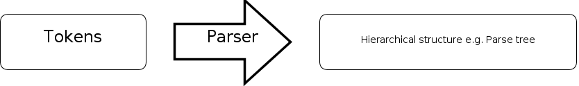
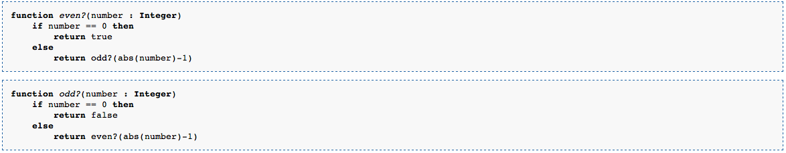
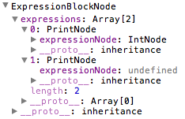

# 三、語法分析器（Parser）﹣語法分析（Syntactic analysis）（上）

現在我們有了 Scanner 幫我們把字元合併成 Token 了，那下一步要做什麼呢？就是要把 Token 組合成有意思的 “句子” 了，這一步我們稱為語法分析（Syntactic analysis），而負責做這項工作的程式我們稱之為語法分析器（Parser）。



## Parse tree

Parser 要做的工作就是，讀取 Scanner 分析出來的 Token，然後建立並返回一棵 Parse tree 給後面做語意分析（下一章再談談）。什麼是 Parse tree 呢？維基上的解釋是：

> an ordered, rooted tree that represents the syntactic structure of a string according to some formal grammar

意思就是一棵可以形容到你寫的句子的樹了，例如你的句子是 `if a then b else c` ，那你的樹就可能會是這樣了：


為什麼不用一些現成的工具來自動生成 Parser 呢？

其實市面上有一些很好的工具可以根據大家寫下的規則來生成 Scanner 及 Parser，例如 [ANTLR](https://www.antlr.org/) ， [Flex](https://github.com/westes/flex)（生成 Scanner） 及 [Bison](https://www.gnu.org/software/bison/)（生成 Parser），不用它們的原因有三：第一、用了它們的話西傑就沒工作嚕。第二、它們大部份的 documentation 做得很差，而且網上缺乏教學，要學習的話要花很多時間，然而比起自己寫 Scanner 及 Parser 又快不了多少。第三，自己寫的通常會更加 user-friendly ，可以輸出更多種錯誤訊息給開發人員 debug 。更多討論可以在[這裡](https://softwareengineering.stackexchange.com/questions/17824/should-i-use-a-parser-generator-or-should-i-roll-my-own-custom-lexer-and-parser)看看。

## Top-down parser

我們可以根據 Parser 建立 Parse tree 的方法來分類，一種是 Top-down parsing，另一種是 Bottom-up parsing。Top-down parsing 的意思就是先由 root 開始，一步一步地把 descendant 加到 root 之下， Bottom-up parsing 就是剛好相反，由 leaf 開始建立到 root，還是那句吧，想知得更詳細就看[維基](http://en.wikipedia.org/wiki/Parsing#Types_of_parser)吧。

我們這裡會做的是 Recursive descent parser ，是其中一種 Top-down parser ，它是由多個 mutually recursive functions 組成的，什麼是 mutually recursive functions ？即是各個 function 都可能會互相利用來做 recursion ，看看代碼你就會大概知道是什麼意思了。



取自維基

除此之外，我們的 Recursive descent parser 還會使用 lookahead 的技巧，lookahead 在我們 Parser 裡的意思就是多看一個 Token 再決定走向，類似我們之前做 Scanner 時的 nextChar-retract 技巧。

廢話說完了，正式開始寫 code，第一步我們要為我們的 Parser 建立讀取 Token 的 function 以及 lookahead 的 function 。

```js
//Parser class
function Parser(scanner) {
    this.scanner = scanner;
    this.currentToken = new Token();
    this.lookaheadToken = new Token();
    this.lookaheadToken.consumed = true;
}
Parser.prototype.nextToken = function () {
    if (this.lookaheadToken.consumed) {
        var token = this.scanner.nextToken();
        //skip comments
        while (token == Token.tokens.LINECOMMENT_TOKEN || token == Token.tokens.BLOCKCOMMENT_TOKEN) {
            token = this.scanner.nextToken();
        }
        this.currentToken.type = token;
        this.currentToken.text = this.scanner.currentToken.text;
        return token;
    } else {
        this.currentToken.type = this.lookaheadToken.type;
        this.currentToken.text = this.lookaheadToken.text;
        this.lookaheadToken.consumed = true;
        return this.currentToken.type;
    }
}
Parser.prototype.lookahead = function () {
    if (this.lookaheadToken.consumed) {
        var token = this.scanner.nextToken();
        //skip comments
        while (token == Token.tokens.LINECOMMENT_TOKEN || token == Token.tokens.BLOCKCOMMENT_TOKEN) {
            token = this.scanner.nextToken();
        }
        this.lookaheadToken.type = token;
        this.lookaheadToken.text = this.scanner.currentToken.text;
        this.lookaheadToken.consumed = false;
        return token;
    } else {
        return this.lookaheadToken.type;
    }
}
```

`nextToken ()` 要處理的事情有兩項，第一是看看 lookahead 的 Token 被使用了沒有，使用了的話就由 Scanner 再讀取下一個 Token ，否則只需使用 lookahead 的 Token 。第二是忽略所有 comment ，當然如果在你的語言中 comment 是有特別作用的話（如 PHP 中有些 library 會用 comment 來做 Annotation）你也可以保留。

`lookahead ()` 的作用就是 lookahead 嚕，不過如果已經有一個 lookahead 了的 Token 就不要再讀下一個了（直至它被使用了），一般來說能夠 lookahead 一個 Token 已經足夠，如不足夠的話，大概是因為你設計的語言很複雜……

現在寫一個 Tester 程式來試試這些功能吧。

```js
var dataToBeCompiled = $("#wescript").text();
var reader = new Reader(dataToBeCompiled);
var scanner = new Scanner(reader);
var parser = new Parser(scanner);
while (true) {
    if (parser.lookahead() == Token.tokens.PLUSPLUS_TOKEN) {
        log("lookahead: PLUSPLUS_TOKEN");
    }
    if (parser.lookahead() == Token.tokens.PLUSPLUS_TOKEN) {
        log("lookahead again: PLUSPLUS_TOKEN");
    }
    var token = parser.nextToken();
    log("Token: " + Token.backwardMap[token]);
    if (token == Token.tokens.EOS_TOKEN) {
        break;
    }
}
```

如果 lookahead 遇到 `++` 的話就會輸出兩次 `“lookahead: …”` 那句，這可以用來試試是否只能 lookahead 一個 Token ，亦可以試試 `nextToken ()` 是否能先讀取 lookahead Token 然後才讀下一個 Token ，再者也要試試是否真的忽略了 comment 。

運作正常！現在可以開始讀 Wescript 的 syntax 了，首先我們要準備一個入口給人調用這個 Parser。

```js
//the entry point of our parser
Parser.prototype.parse = function () {
    var rootBlock = new ExpressionBlockNode();
    this.parseExpressions(rootBlock);
    return rootBlock;
}
```

Wescript 是由 N 句 expression 組成的，那入口當然是要 `parseExpressions` 啦， `parseExpressions` 要做的東西就是分析 Wescript 並且把程式分為 N 句 expression，將其寫到 `ExpressionBlockNode` 裡。

```js
//to parse a list of expressions
Parser.prototype.parseExpressions = function (expressionBlockNode) {
    while (this.lookahead() != Token.tokens.RIGHTBRACE_TOKEN &&
            this.lookahead() != Token.tokens.EOS_TOKEN) {
        var expressionNode = this.parseExpression();
        if (expressionNode) {
            expressionBlockNode.push(expressionNode);
        }
    }
}
```

就是一直 lookahead ，如果未遇到 `“}”` `RIGHTBRACE_TOKEN` 或者未到結尾的話就一直 `parseExpression` 下去。

為什麼是用 `lookahead` 而不是用 `nextChar` 呢？

因為 `parseExpressions` 不能夠亦不應該 “吃” 掉屬於 expression 的 Token（而不是屬於 expressions 的），不然當你 `parseExpression` 的時候那句 expression 就會少了一個 Token 。

```js
//to parse an expression
Parser.prototype.parseExpression = function () {
    switch (this.lookahead()) {
        case Token.tokens.PRINT_TOKEN:
            var printToken = this.nextToken();
            var expressionNode = this.parseExpression();
            return new PrintNode(expressionNode);
            break;
        case Token.tokens.INTLITERAL_TOKEN:
            var intToken = this.nextToken();
            return new IntNode(this.currentToken.text);
            break;
        default:
            //unexpected, consume it
            this.nextToken();
    }
}
```

`parseExpression` 做什麼呢？暫時只處理兩種 expression ，一種是 `“print”` ，一種是數字，當我們遇到 `PRINT_TOKEN` 或者 `INTLITERAL_TOKEN` 時就會建立並返回相應的 Node ，如果是 `PRINT_TOKEN` 的話更會再 `parseExpression` 一下，因為 `print` 後面是要配上一個 expression 才可以的嘛（看到嗎？這就是 syntactic level 的規則了）。現在修改一下 Tester 程式再試試運行一下吧，今次會用 `console.log ()` 來查看一下建立出來的樹是否正確。



看看 console。

`root` 就是 `ExpressionBlockNode` 了，下面是由 N（這裡是 2）句 expression 組成，其中一句就是 `print` 了，所以建立了 `PrintNode` 。

## 錯誤匯報

注意到 `expressions [1]` 那個 `PrintNode` 的 `expressionNode` 是 `undefined` 嗎？因為那句 Wescript 是 `print;` ，所以分析不到下一句 expression 了，如果我想 `print` 後面一定要有 expression 的話，那這個情況就算是 syntax error 了，我們可以怎樣告訴開發人員這個錯誤呢？那就要修改一下 `PRINT_TOKEN` 那個 case 了。

```js
case Token.tokens.PRINT_TOKEN:
    var printToken = this.nextToken();
    var expressionNode = this.parseExpression();
    if (expressionNode == undefined) {
        Errors.push({
            type: Errors.SYNTAX_ERROR,
            msg: "Missing an expression after \"print\"",
            line: this.scanner.currLine
        });
    }
    return new PrintNode(expressionNode);
    break;
```

加多一個 `if` 去驗證一下 `expressionNode` 是不是一個正常的 Node ，不是的話就匯報錯誤。再看一看運行結果。

錯誤訊息出來了。 

這一節就到此為止，大家先理清以上數個概念吧，下一節會再教大家寫一些更複雜的 expression 。