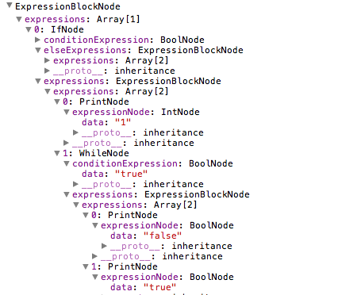

# 三、語法分析器（Parser）﹣語法分析（Syntactic analysis）（中）

上回提到，我們要寫一個 Recursive descent parser ，從 Scanner 一直讀 Token 進來，並建立一棵 Parse tree 。在建立途中，我們還用了 lookahead 的技巧，就是偷看下一個 Token 但是不會佔用它，原因是我們需要用它來判斷下一步怎麼走，但是我們又不能用掉它，否則到下一步時我們就用不到了。現在我們就來完成餘下的部份吧！

上回我們只處理了 `print` 和數字，現在我們來處理一下 `var` 吧。 `var` 主要有兩種寫法，第一種是純粹定義一個變數，即：

```js
var a:bool;
```

第二種是除了定義變數之外，還會 initialise 一下那個變數，即：

```js
var a:int = 1;
```

那我們先來定義一個新的 Node 吧。

```js
function VariableNode(varName, type, initExpressionNode) {
    this.varName = varName;
    this.type = type;
    this.initExpressionNode = initExpressionNode;
}
extend(VariableNode, Node);
```

`VariableNode` 要記著三樣資料，第一是變數的名稱，第二是變數的類型，第三是 initialise 的 expression（這個可以是 `null`）。然後我們要加多一個 case 到 `parseExpression` 中

```js
case Token.tokens.VAR_TOKEN:
    return this.parseVarExpression();
    break;
```

遇到 `var` 時就要啟動 `parseVarExpression` 程序：

```js
Parser.prototype.parseVarExpression = function () {
    //consume "var"
    this.nextToken();
    //expecting an identifier
    if (this.lookahead() == Token.tokens.IDENTIFIER_TOKEN) {
        this.nextToken();
        var varName = this.currentToken.text;
        //consume a colon
        if (this.nextToken() != Token.tokens.COLON_TOKEN) {
            this.skipError();
            return;
        }
        //type token
        if (this.lookahead() != Token.tokens.TYPE_TOKEN) {
            this.skipError();
            return;
        }
        this.nextToken();
        var typeName = this.currentToken.text;
        var initNode;
        //check if it has initialization expression
        if (this.lookahead() == Token.tokens.ASSIGN_TOKEN) {
            initNode = this.parseSimpleAssignmentExpression();
        }
        return new VariableNode(varName, typeName, initNode);
    }
    this.skipError();
}
Parser.prototype.parseSimpleAssignmentExpression = function () {
    //consume the "=" sign
    this.nextToken();
    var expressionNode = this.parseExpression();
    return expressionNode;
}
```

Parse `“var”` 的方法其實就是用 `lookahead` 同 `nextToken` 來讀取 Token，然後再檢查一下這個 Token 是不是我們想要的 Token，如果不是的話就 call 一下 `skipError` 來跳過接下來的 Token，到最後就檢查一下 `“=”` 有沒有出現，出現了的話就再 parse 接下來的 initialisation expression 。現在看看 `skipError` 的做法：

```js
//a naive implementation for skipping error
Parser.prototype.skipError = function () {
    this.scanner.skipNewLine = false;
    while (this.lookahead() != Token.tokens.NEWLINE_TOKEN &&this.lookahead() != Token.tokens.EOS_TOKEN) {
        this.nextToken();
    }
    this.scanner.skipNewLine = true;
}
```

方法很簡單，其實就是一直跳過接下來的 Token ，直至讀到新一行或者再沒有 Token 為止。

為什麼我們要跳過某些 Token 呢？

一個好的 Compiler 不應該一遇到錯誤就停止，而是要儘量把整個程式中的錯誤告知開發人員以便 debug 。

試行一下，看看它有沒有做 Error recovery 以及能否 parse `“var”` expression 。


很好，不但成功建立到正確的 Parse tree ，亦成功地跳過了錯誤。

## Expression block

接著下來我們要處理 `if` 和 `while` ，它們跟我們之前處理過的 expression 有分別，分別在於它們的結構不是一句 expression 接著一個分號就成為一個 expression node，而是先有一個 condition 再配一／兩個 expression block，最後還沒有分號，所以我們要改寫一下 `parseExpressions` ，把讀分號的程式移到每一句期待分號的 expression 中。

```js
Parser.prototype.matchSemicolon = function () {
    //consume the semicolon
    if (this.lookahead() == Token.tokens.SEMICOLON_TOKEN) {
        this.nextToken();
    } else {
        //syntax error
        Errors.push({
            type: Errors.SYNTAX_ERROR,
            msg: "Expecting a semicolon at the end of expression",
            line: this.scanner.currLine
        });
    }
}
```

把 match 分號的程式抽出來，叫 `matchSemicolon` ，方便後面使用。

```js
case Token.tokens.IF_TOKEN:
    return this.parseIfExpression();
    break;
case Token.tokens.WHILE_TOKEN:
    return this.parseWhileExpression();
    break;
```

新增兩個 case 到 `parseExpression` 中，遇到 `if` 或者 `while` Token 都會另外處理。

```js
Parser.prototype.parseIfExpression = function () {
    //consume "if"
    this.nextToken();
    var condition = this.parseParenExpression();
    var expressions = this.parseExpressionBlock();
    var elseExpressions;
    if (this.lookahead() == Token.tokens.ELSE_TOKEN) {
        //consume "else"
        this.nextToken();
        elseExpressions = this.parseExpressionBlock();
    }
    return new IfNode(condition, expressions, elseExpressions);
}
```

遇到 `if` 的時候要做什麼呢？首先當然是讀取 condition，就是那句 `parseParenExpression` ，然後就要讀取一個 expression block ，即被 `“{”` `“}”` 包住的 expression list ，接著還要判斷一下有沒有 `else` ，有的話還要讀取整個 else block 進來。 `while` 的做法跟 if 差不多，這裡就不多討論了。



還有個 boss 要打，就是那堆運算符了，由於這部份比較複雜，所以西傑決定開多一節詳談當中的細節，下星期四再見吧！