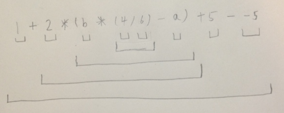
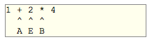
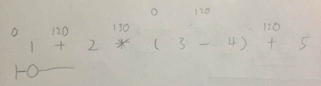
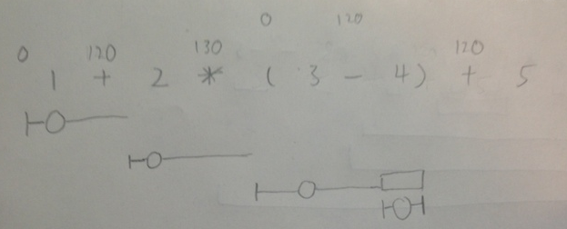
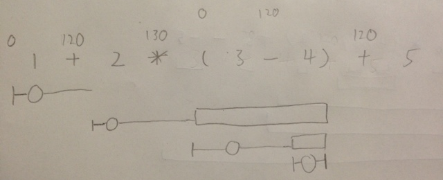
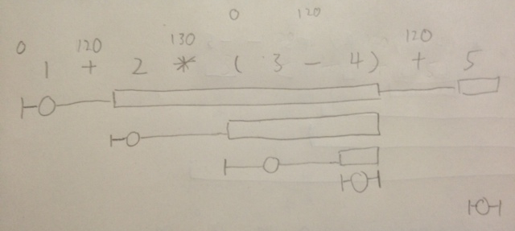

# 三、語法分析器（Parser）﹣語法分析（Syntactic analysis）（下）

在上一節中，我們處理了 `“var”` `“if”` `“while”` ，大家應該學會了如何處理 expression block 了，這一節我們將會學習如何處理運算符。處理運算符有兩個基本概念要掌握，第一是運算符的運算次序，第二是運算表達式的表示法。

## 運算次序（Order or operations）

在數學算式裡，我們有個法則叫做 “先乘除，後加減”，意思就是乘除的運算次序比加減高，同樣地在程式語言中，我們也需要定義一下運算符的運算次序。在 Wescript 中，我們會用常用的運算符次序，即如下圖所示：


取自維基

西傑不會處理這裡所列的所有運算符，只會處理第一章所列的運算符，其他就留給讀者們當練習吧。

## 表示法

西傑相信大部份人都會使用 infix notation（可能用完也不知道它的名稱原來就是 infix notation ），但其實這世界上還有兩種運算式表示法， prefix notation 和 postfix notation ，看看例子大家就會明白這是什麼概念。

```
Infix notation: 1 + 2 * 3

Prefix notation: + 1 * 2 3

Postfix notation: 1 2 3 * +
```

我們日常寫程式時使用的都是 infix notation，但是對電腦來說，postfix notation 比較容易處理（通常會用一個 stack 來處理），因此我們的 Parser 將會讀進 Infix notation，到 compile 時就會轉為 postfix notation。

## 分項（或稱運算元 operand ）

開始寫程式了，第一件事情是要分項，什麼是分項呢？就是把一句 expression 斬成多個項目，怎樣才算是一個項目呢？看看下圖：



項目包括以上所列的幾種：數值（數字和布林值），負數值，包著一堆子項目的括號，變數。根據這個分類法，我們可以改寫出 parse 項目的 function 。

```js
Parser.prototype.parseOperand = function () {
    var token = this.nextToken();
    var operandNode;
    switch (token) {
        case Token.tokens.INTLITERAL_TOKEN:
            operandNode = new IntNode(this.currentToken.text);
            break;
        case Token.tokens.BOOLLITERAL_TOKEN:
            operandNode = new BoolNode(this.currentToken.text);
            break;
        case Token.tokens.IDENTIFIER_TOKEN:
            operandNode = new IdentifierNode(this.currentToken.text);
            break;
        case Token.tokens.LEFTPAREN_TOKEN:
            operandNode = new ParenNode(this.parseCompoundExpression(0));
            //consume the right paren )
            if (this.lookahead() == Token.tokens.RIGHTPAREN_TOKEN) {
                this.nextToken();
            } else {
                Errors.push({
                    type: Errors.SYNTAX_ERROR,
                    msg: "Missing right paren \")\"",
                    line: this.scanner.currLine
                });
            }
            break;
        case Token.tokens.MINUS_TOKEN:
            operandNode = new NegateNode(this.parseOperand());
            break;
        default:
            //not valid
            Errors.push({
                type: Errors.SYNTAX_ERROR,
                msg: "Unexpected token",
                line: this.scanner.currLine
            });
            return null;
    }
    return operandNode;
}
```

頭三款分別為數字，布林值和 identifier （即變數），只是很簡單的讀進一個 token 再建立一個 node 。遇到左括號時就有點特別了，這時我們要 `parseCompoundExpression` ，意思就是要處理更複雜的 expression （例如： `1 + 2 * 3` ），我們待會兒就會寫這個 function 。接著當我們遇到 `“-”` 時，我們就要再讀多一個項目，因為這個 `“-”` 代表負數值，我們要建立一個 `NegateNode` 。最後如果都不是以上幾款的話就算是 syntax error 了。

之前我們是在 `parseExpression` 中處理數值的，現在我們要從中抽起，放到 `parseOperand` 當中！

`parseCompoundExpression` 的 algorithm 如下，先大約看一看，下面再解釋。

```js
Parser.prototype.getBindingPower = function (token) {
    switch (token) {
        case Token.tokens.PLUS_TOKEN:
        case Token.tokens.MINUS_TOKEN:
            return 120;
        case Token.tokens.MULT_TOKEN:
        case Token.tokens.DIV_TOKEN:
            return 130;
    }
    return -1;
}
Parser.prototype.createOperatorNode = function (operatorToken) {
    switch (operatorToken) {
        case Token.tokens.PLUS_TOKEN:
            return new OperatorPlusNode();
            break;
        case Token.tokens.MINUS_TOKEN:
            return new OperatorMinusNode();
            break;
        case Token.tokens.MULT_TOKEN:
            return new OperatorMultNode();
            break;
        case Token.tokens.DIV_TOKEN:
            return new OperatorDivNode();
            break;
    }
}
Parser.prototype.parseCompoundExpression = function (rightBindingPower) {
    var operandNode = this.parseOperand();
    if (operandNode == null) {
        return operandNode;
    }
    var compoundExpressionNode = new CompoundNode();
    compoundExpressionNode.push(operandNode);
    var operator = this.lookahead();
    var leftBindingPower = this.getBindingPower(operator);
    if (leftBindingPower == -1) {
        //not an operator
        return compoundExpressionNode;
    }
    while (rightBindingPower < leftBindingPower) {
        operator = this.nextToken();
        compoundExpressionNode.push(this.createOperatorNode(operator));
        var node = this.parseCompoundExpression(leftBindingPower);
        compoundExpressionNode.push(node);
        var oper = this.lookahead();
        leftBindingPower = this.getBindingPower(oper);
        if (leftBindingPower == -1) {
            //not an operator
            return compoundExpressionNode;
        }
    }
    return compoundExpressionNode;
}
```

這個 algorithm 是取自 Vaughan Pratt 的（好似係），但我是在 [Eli Bendersky](http://eli.thegreenplace.net/2010/01/02/top-down-operator-precedence-parsing/) 那裡學的。看起來有點複雜了吧，放心，我慢慢地來 。

## Binding Power

由於運算符運算時有先後次序之分，我們的 compiler 也需要處理，而 Wescript compiler 處理的方法就是賦予每一個運算符一個 binding power ，Binding Power 高的運算符可以佔有其相鄰的項目，如 Eli 的例子所示：



B 比 A 強，所以佔有 E （唉，連電腦的世界裡也是弱肉強食……）。因此，我們需要先設定運算符的 binding power ，這就是 `getBindingPower` 的工作了。到戲肉了，這裡我會用靜態動畫（靜態的動畫）來描述這個 algorithm 的工作。


開始時是這樣的，注意括號的 binding power 是 0 ，因為我把它當成項目，而不是普通的運算符。



現在開始執行，一開始的 `rightBindingPower` 是 0 ，讀取了一個項目（以圓形表示），由於 `“+”` 的 binding power 較強，所以這句判斷成立：

```js
while (rightBindingPower < leftBindingPower) { //0 < 120
```

注意不要搞錯左和右，這裡的左是指運算符的左面，而不是項目的左面
接下來就是要 recursive 地再運行 `parseCompoundExpression` 。


同樣地，讀取一個項目，檢查一下右面的運算符的 `leftBindingPower` ，發現 `rightBindingPower (120)`  比 `leftBindingPower (130)`  小，於是就再運行一個新的 recursion 。


接下來的 3 – 4 的處理方法跟上面相似，但有些分別，括號是當成一個項目來處理，所以 binding power 由 0 開始，當讀到 4 的時候，再讀一個運算符時，我們會讀到 “)” 右括號，當我們嘗試拿取它的 binding power 時就會拿到 -1，於是是次 recursion 直接終止。



然後括號也處理好了，也可以 return 了。



由於下一個運算符 `“+”` 的 binding power `(120)` 比現在的 `（130）` 小，所以也可以 return 了。

可不可以用 `rightBindingPower <= leftBindingPower` 而不是 `rightBindingPower < leftBindingPower` 呢？
不可以，想想這個例子， `1 – 2 + 3` ，由於 `“-”` 和 `“+”` 的 binding power 一樣，如果用小於或等於的話， parse tree 將會當成 `1 – (2 + 3)`


現在連 `2 * (3 – 4)` 也可以 return 了，因為 `1 + 2` 的 `“+”` 的 binding power 並不比 `+ 5` 的 `“+”` 小。返回之後， binding power 為 0 的那個 function 將會繼續讀取運算式直至讀取所有運算式為止。



就是這樣了，很簡單吧？不明白的多看幾次以上的例子吧，再不明白的話就留個言，西傑很快會跟進的了。現在看看這段程式是不是運作正常。

看看 `console.log` ，程式運作正常。現在把餘下的運算符都編寫下來！

這段程式主要編寫了邏輯運算符，看看 `console.log` ，還是運作正常。那我們現在寫餘下的 assignment 運算符吧。

`“=”` `“+=”` `“-=”` 其實沒有什麼特別處理方法，跟之前的運算符差不多，這裡就不詳述了。但是 `“++”` 和 `“–”` 就有特別了，它們是 unary 運算符，同時又可以作 pre-in/decrement 或 post-in/decrement ，這樣要如何處理呢？西傑就把它們當成 operand 一樣來處理，而且一定要配合 identifier 使用，看看代碼。

```js
case Token.tokens.IDENTIFIER_TOKEN:
    operandNode = new IdentifierNode(this.currentToken.text);
    if (this.lookahead() == Token.tokens.MINUSMINUS_TOKEN) {
        //post decrement
        this.nextToken();
        operandNode = new PostDecrementNode(operandNode);
    } else if (this.lookahead() == Token.tokens.PLUSPLUS_TOKEN) {
        //post increment
        this.nextToken();
        operandNode = new PostIncrementNode(operandNode);
    }
break;
```

首先處理 post-in/decrement ，方法很簡單，就是當我們遇到 identifier 時，我們就會 lookahead 一下，看看有沒有 `“++”` 或者 `“–”` ，有的話就用 `PostIn/DecrementNode` 來取代原本的 `operandNode` ，沒有就自然不用理會啦。

```js
case Token.tokens.PLUSPLUS_TOKEN:
    if (this.lookahead() == Token.tokens.IDENTIFIER_TOKEN) {
        this.nextToken();
        operandNode = new PreIncrementNode(newIdentifierNode(this.currentToken.text));
    } else {
        Errors.push({
            type: Errors.SYNTAX_ERROR,
            msg: "Expecting an identifier for pre-increment expression",
            line: this.scanner.currLine
        });
        return null;
    }
    break;
```

之後要增加 `PreIn/Decrement` 的處理，就是增加一個 case 到 `parseOperand` 中，遇到 `“++”` 或 `“–”` 就會 lookahead 一下看看有沒有 identifier ，有的話就是 `PreIn/Decrement` ，沒有的話應該算是 syntax error 了吧。

看看 `console.log` ，還是運作正常，那就大功告成啦！！！

## Put it together

現在看看完整的 Parse tree（console.log）

## 總結

兩個星期的 Syntactic analysis 課程終於完結了，不知道大家吸收了多少，其實編寫 Parser 說難不難，說易不易，基本來說就是一堆 mutual recursion，把大問題斬件成為多個小問題，逐點擊破就可以了，只要大家思緒清晰的話，其實不難（當然要思緒清晰也確實不易）。

大家可以放心，最難捱的時刻已經過了，下一章會比這章容易一點，大家如果仍然未搞清這章的思路的話不妨留下你的問題，西傑一定會儘量解答，拜拜，下星期再見。
