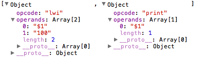

# 五、虛擬機（Virtual Machine）

為什麼我們需要虛擬機呢？因為我們要運行我們編譯好的程式。那為什麼我們不直接編譯到 native binary code 呢？這是因為真正的電腦資源十分有限，我們編寫起上來會比用虛擬機的做法難很多，那就嚴重超出了本教程的範圍了（其實是因為西傑還不太認識這個課題，要偷懶一下）。當然，虛擬機的做法和 native code 的也有幾分相似，這裡就給讀者們一個初步的概念，大家真的想再接觸多一點底層的東西就要自己摸索一下了……

接著下來，我們就稱我們的虛擬機為 Wemachine 吧。

遊戲開始之前，我們當然要先定義一下遊戲規則﹣ Instruction set architecture（ISA），Wemachine 會支持以下的 Instruction set：

| Instruction | Example | Meaning | Comments |
| --- | --- | --- | --- |
| Arithmetic |
| add | add $1,$2,$3 | $1 = $2 + $3 |   |
| subtract | sub $1,$2,$3 | $1 = $2 – $3 |   |
| mult | mult $1,$2,$3 | $1 = $2 * $3 |   |
| div | div $1,$2,$3 | $1 = $2 / $3 |   |
| modulo | mod $1,$2,$3 | $1 = $2 % $3 |   |
| add immediate | addi $1,$2,100 | $1 = $2 + 100 |   |
| subtract immediate | subi $1,$2,100 | $1 = $2 – 100 |   |
| multiply immediate | multi $1,$2,100 | $1 = $2 * 100 |   |
| divide immediate | divi $1,$2,100 | $1 = $2 / 100 |   |
| modulo immediate | modi $1,$2,100 | $1 = $2 % 100 |   |
| Logical |
| and | and $1,$2,$3 | $1 = $2 & $3 | Logical AND |
| or | or $1,$2,$3 | $1 = $2 | $3 | Logical OR |
| Data transfer |
| move data from register to another register | move $1,$2 | $1 = $2 |   |
| load data | lwi $1,100 | $1 = 100 |   |
| load upper immediate | lui $1,100 | $1 = 100 * 2^16 |   |
| Conditional branch |
| define LABEL | label LABEL | LABEL: |   |
| branch on equal | beq $1,$2,LABEL | if ($1 == $2) goto LABEL |   |
| branch on not equal | bne $1,$2,LABEL | if ($1 != $2) goto LABEL |   |
| branch on less than | bl $1,$2,LABEL | if ($1 < $2) goto LABEL |   |
| branch on greater than | bg $1,$2,LABEL | if ($1 > $2) goto LABEL |   |
| branch on less than or equal | ble $1,$2,LABEL | if ($1 <= $2) goto LABEL |   |
| branch on greater than or equal | bge $1,$2,LABEL | if ($1 >= $2) goto LABEL |   |
| Unconditional jump |
| jump | j LABEL | goto LABEL |   |
| Others |
| print | print $1 | print $1 |   |

而且西傑將會假設我們的虛擬機有無限個 register ，以便我們開發。

開始寫程式了，第一步我們要做的是讓 Wemachine 學會讀那堆指令，為了方便讀取，我們要限定指令的格式，格式如下：

```
opcode1 operand1, operand2, operand3;

opcode2 operand1, operand2;
```

每個指令由分號分隔開，在第一個空格號前的為指令的 opcode ，接下來是一至三個 operand ，以逗號分隔開，就是這麼簡單了。現在先開始寫一個 Parser 來分析以此格式寫的程式，西傑相信這一步應該很簡單，現在看看運行結果。



現在要開始實現功能了，首先要有 register 以記下數據，這個西傑會用一個 array 來做，$0 指向 array 第 0 個元素，$1 指向第 1 個元素，如此類推。然後我們要寫兩個 method 來 get set register 的數據，如果那個 register 未被使用過的話，它的數據就會是 0。於是我們就有了以下的程式：

```js
Wemachine.prototype.resolveRegister = function (operand) {
    if (typeof operand == "string" && operand.length > 0) {
        if (operand[0] == "$") {
            return parseInt(operand.substr(1));
        }
    }
    Errors.push({
        type: Errors.RUNTIME_ERROR,
        msg: "Fail to resolve register",
        line: 0
    });
    return -1;
}
Wemachine.prototype.getRegisterContent = function (operand) {
    operand = this.resolveRegister(operand);
    if (operand != -1) {
        if (this.registers.length > operand) {
            return this.registers[operand];
        }
    }
    return 0;
}
Wemachine.prototype.setRegisterContent = function (operand, value) {
    operand = this.resolveRegister(operand);
    if (operand != -1) {
        this.registers[operand] = value;
    }
}
```

現在開始要編寫執行功能，執行功能很簡單，只是把每一句指令都執行一次就可以了。

```js
Wemachine.prototype.run = function () {
    for (var i = 0, l = this.instructions.length; i < l; i++) {
        var instruction = this.instructions[i];
        this[instruction.opcode].apply(this, instruction.operands);
    }
}
```

最後就是要編寫指令的實際功能了，lwi 要做的就是直接把一個數值寫到 register 中，所以我們只需 call 一下 `setRegisterContent` 就可以了，而 print 要做的就是把一個 register 中的數值寫到 output 去，所以就有以下的代碼了：

```js
Wemachine.prototype.lwi = function (operand1, operand2) {
    this.setRegisterContent(operand1, parseInt(operand2));
}
Wemachine.prototype.print = function (operand1) {
    var val = this.getRegisterContent(operand1);
    log(val);
}
```

放在一起，我們運行一下程式，看看結果。

很好，現在就把餘下的 Data transfer 功能都編寫下來吧。

```js
Wemachine.prototype.move = function (operand1, operand2) {
    this.setRegisterContent(operand1, this.getRegisterContent(operand2));
}
Wemachine.prototype.lwi = function (operand1, operand2) {
    this.setRegisterContent(operand1, parseInt(operand2));
}
Wemachine.prototype.lui = function (operand1, operand2) {
    this.setRegisterContent(operand1, parseInt(operand2) << 16);
}
```

很直觀，沒什麼特別之處，這裡就不多解釋了。 Arithmetic 的處理其實都很直觀，唯一需要提醒讀者的地方是，做除數運算是有可能會出現 Division by zero 的情況，所以我們要發出 runtime error 。

Logical 跟 Arithmetic 的處理方法很相似，這裡就不著墨了。現在到最後要寫 `branch` 和 `jump` 了，要實現這個功能，我們要改變一下程式執行的方法，記得我們的 `run` method 嗎？我們的 `run` method 是用 `i` 來做 loop counter 的，現在要改變一下了，要用 program counter 取代 i，這樣我們才可以在其他方法中改變運行次序。

在 `label ()` 中，我們要把想定義的 label 和 program counter 的數值放到 map 裡，這樣我們才可以在後面的程式設定要跳到哪一個位置。現在看看我們的 bne ：

```js
Wemachine.prototype.bne = function (operand1, operand2, operand3) {
    var nextPC = this.labelMap[operand3];
    if (nextPC == null) {
        Errors.push({
            type: Errors.RUNTIME_ERROR,
            msg: "Label not found",
            line: 0
        });
    } else {
        var val1 = this.getRegisterContent(operand1);
        var val2 = this.getRegisterContent(operand2);
        if (val1 != val2) {
            this.pc = nextPC;
        }
    }
}
```

首先要在 map 中找找有沒有相關的 label ，沒有的話就要發出錯誤，有的話就要看看條件是否成立，是的話就要把 program counter 設定為要跳到的位置，這樣程式在下次 loop 的時候才可以跳到 label 那處。現在看看程式運行結果吧！

現在把剩下來的 `branch` 都寫下來。

大功告成，怎麼樣，如西傑之前所說，這部份不是很難吧，如果大家曾經學過 assembly language 的話應該更容易上手！現在有了這個簡單的虛擬機，下一步我們就可以把之前建立的 parse tree 變成可以在這個 Wemachine 運行的代碼了，下個星期再見吧。
